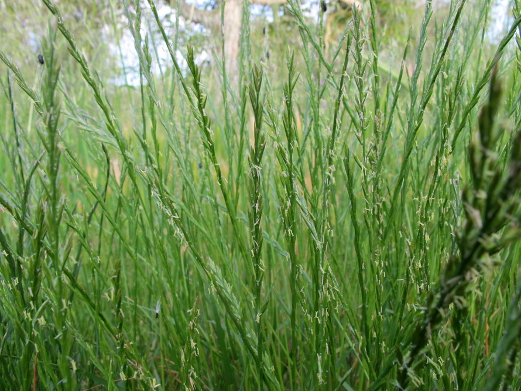

```{r setup, include=FALSE}
library(learnr)
library(mosaic)
library(car)
library(tidyr)
library(magrittr)
plant_growth <- read.csv("www/plant_growth.csv")
lolium <- read.csv("www/grass_growth.csv")
plasma <- read.csv("www/plasma.csv")
anr <- read.csv("Data/anr_ancova.csv")
knitr::opts_chunk$set(echo = FALSE)
```


## Multiple explanatory variables
### Interactions
When you have multiple explanatory variables they may not always be independent
of each other, and they 'interact' in some way. This means that the effect of one
explanatory variable on the response also depends on the value of the other
explanatory variable. These interactions can arise when all your explanatory
variables are categorical, when they are all continuous, or where you have a
mixture of categorical and continuous explanatory variables.

### Example with categorical explanatories
The amount of calcium in blood plasma samples (mg / 100 ml) was measured in
male and female rabbits, half sampled from a lowland intensive arable farm, and
half from an upland mixed farm.


As usual it is useful to plot the data before analysing them. As we have 
categorical variables, a boxplot is informative, but we can easily colour code
the boxes two show all four combinations in one plot:

```{r plasma_boxplot, echo=TRUE}
gf_boxplot(calcium ~ site, color= ~ sex, data=plasma)
```

**Key points**

* Use the `colour= ~sex` option in `gf_boxplot()` to arrange the colour-coding.
* You could easily put gender on the x-axis, and colour-code by lowland/upland
* Calcium levels appear to be lower in males than females
* The difference between males and females appears to be bigger at lowland
than upland sites

It is that last point that is critical. Indeed, if you were to a draw line
connecting the two boxplots for the males and a second line connecting the two
boxplots for the females, the gradients of those lines would not be parrallel.
This suggests non-independence, i.e. an **interaction** is present.

## How to test for an interaction
It is easy to test whether an interaction occurs, by adding a third explanatory
variable. Your original model is:

$$Response = Explanatory1 + Explanatory2 + Error$$
which is modified to:
$$Response = Explanatory1 + Explanatory2 + Interaction + Error$$
For this rabbit example, the latter is therefore:
$$calcium = site + sex + site\ sex\ interaction + Error$$
This can easily be entered into the `lm` function, using the `:` operator to
define the interaction term. Put the interaction term last.

```{r plasma_lm_interaction, echo=TRUE}
calcium_lm <- lm(calcium ~ site + sex + site:sex, data=plasma)
Anova(calcium_lm)
```

You can see from the ANOVA table indicates that:

* the `site` main effect is **not significant** as P=8.985896e-01 = 0.896. There is **no difference** in the mean calcium levels at the upland and lowland sites
* the `sex` main effect **is significant** as P=0.000000000678 is < 0.001. There is **more calcium** in the blood of females than males
* the `site:sex` term **is significant** as P=0.00000356 is <0.001. The amount of calcium depends on **both site and gender**

That last bullet point might seem confusing at first. If `site` on its own is
not significant, how can the interaction `site:sex` be significant? Let's look
at the three components and plot them

```{r separate_plots, echo=TRUE, warning=FALSE}
# Main effect for site
gf_boxplot(calcium ~ site, data=plasma)

# Main effect for sex
gf_boxplot(calcium ~ sex, data=plasma)

# Show original data, and lines connecting the two sets of means
gf_point(calcium ~ site, colour= ~sex, data=plasma) %>%
  gf_line(calcium ~ site, colour= ~sex, group= ~sex, stat="summary", data=plasma)
```

**Key points**

* The boxplots for site overlap considerably, hence non-significant `site` main
effect
* Boxplots for sex show little overlap, hence significant `sex` main effect
* lines connecting the means for the two groups **are not parallel** hence
significant interaction term

### Should I drop the non-significant site main effect from the model?
You might be wondering whether you should omit the `site` main effect and have a
model that consists only of the `sex` main effect plus the `sex:site` interaction:

$$calcium = site + sex + site\ sex\ interaction + Error$$
There is not a consensus amongst statisticians on this issue, but **if the interaction is significant** then is best to keep the main effect that is not significant. If you want to simplify a model down to its simplest form, **always look at the interaction term first**.
If the interaction is non-significant, then you are justified in re-running the
model without the interaction, and looking at the main effects. In this example, the
interaction is significant so it is best to keep `site`and report that it is not significant. This is because there is something going between `sex` and `site` that is important biologically.

## Interactive demonstration
### Simulating main effects and interactions
We can think more about what happens when we have interaction between two of our explanatory variables using the following interactive demonstration. The interactive demonstration sliders allow you to modify the relative importance of the two main effects from the rabbit example (`sex` and `site`) and the interaction term. Adjust the sliders to change the importance, and note the differences in the resulting graph, and ANOVA table from the linear model.

**Note**

* A slight randomisation is used in changing the data, therefore you will not
obtain exactly the same results for any given setting of the sliders. However,
they will be roughly similar.
* I suggest you start by reducing the slider for the interaction term to zero,
and adjust the two main effects. Once the interaction comes into force it can
be more difficult to interpret.

```{r, echo=FALSE}
    # Application title
    titlePanel("Understanding interactions")

    sidebarLayout(
        sidebarPanel(
            sliderInput("sex_effects",
                        "Difference in males & females (sex main effect)",
                        min = 0,
                        max = 10,
                        value = 5),
            sliderInput("site_effects",
                        "Difference in uplands & lowlands (site main effect)",
                        min = 0,
                        max = 10,
                        value = 5),
            sliderInput("interaction_effects",
                        "Interaction between site and sex",
                        min = 0,
                        max = 10,
                        value = 5)
        ),

        mainPanel(
           plotOutput("myplot"),
           tableOutput("anova_table")
        )
    )
```
```{r, context="server"}
    rabbits_data <- reactive({
        nsample <- 10 
        n.sex <- 2 # females and males
        n.elev <- 2 # lowland and upland
        n <- n.sex * nsample
        
        # Create factor levels
        sex <- gl(n = n.sex, k = nsample, length = n)
        elev <- gl(n = n.elev, k = nsample/n.elev, length = n)
        
        # Choose effects THESE CAN BE TWEAKED BASED ON SLIDERS
        # Initial values from lm of rabbits with interaction
        baseline <- 36.10  # Intercept; Females at lowland
        sex.effects <- -21.46 * (input$sex_effects/5)
        elev.effects <- -7.60 * (input$site_effects/5)
        interaction.effects <- 14.92 * (input$interaction_effects/5)
        all.effects <- c(baseline, elev.effects, sex.effects, interaction.effects)
        
        sigma1 <- 3.53
        sigma2 <- 1.82
        sigma3 <- 1.33
        sigma4 <- 2.42
        eps1 <- rnorm(n, 0, sigma1) # residuals
        eps2 <- rnorm(n, 0, sigma2) # residuals
        eps3 <- rnorm(n, 0, sigma3) # residuals
        eps4 <- rnorm(n, 0, sigma4) # residuals
        
        X <- as.matrix(model.matrix(~ sex*elev))
        
        est_calcium <- as.numeric(as.matrix(X) %*% as.matrix(all.effects))
        est_calcium[1:5] <- est_calcium[1:5] + eps1
        est_calcium[6:10] <- est_calcium[6:10] + eps2
        est_calcium[11:15] <- est_calcium[11:15] + eps3
        est_calcium[16:20] <- est_calcium[16:20] + eps4
        
        elev_lab <- gl(2, 10, labels = c("lowland", "upland"))
        sex_lab  <- gl(2,5,20, labels = c("Females", "Males"))
        est_calcium_df <- data.frame(calcium=est_calcium, sex=sex_lab, site=elev_lab)
        return(est_calcium_df)
        
    })

    output$myplot <- renderPlot({
      gf_point(calcium ~ site, colour = ~sex, data=rabbits_data()) %>% 
        gf_line(calcium ~ site, colour= ~sex, group= ~sex, stat="summary", data=rabbits_data()) %>% 
        gf_lims(y = c(-5, 40))
    })
    
    output$anova_table <- renderTable({
      data.frame(anova(lm(calcium ~ sex + site + sex:site, data=rabbits_data())))
    },
    include.rownames = TRUE)

```

### Key points to note:

* When there is no interaction (set to zero) the lines are roughly parallel
* Try setting the interaction to zero and one of the main effects to zero.
* Note how the bigger a main effect, the more the males/females separate, or
the more the difference between uplands and lowlands
* When the interaction is high it is more challenging to interpret what is
happening!!

## Continuous and categorical variables

We can use continuous and categorical data in the same linear model to test whether a relationship between two continuous variables is different depending on different levels of a categorical variable. This type of linear model can help us compare the intercepts and slopes of two or more regression lines. This type of analysis is sometimes referred to as Analysis of Covariance (ANCOVA). You may find the categorical explanatory variable 
refereed to as a factor and a continuous explanatory variable is sometimes called a covariate. The combination of these two explanatory variables can include an interaction term. A linear model with continuous and categorical explanatory variables still uses the `lm()` function. The key concept here is that the analysis can test whether there are differences in the gradient of the relationship between a response variable and the continuous explanatory variable for multiple levels of the categorical variable. 

For example, if we collect fish from two different locations (e.g. NW and SE), measure their standard lengths and analyse the biochemical composition of their tissue (d13C), we can test whether the gradient and elevation of the lines are significantly different.

In doing this type of analysis it is important to plot your data first.

```{r, ANCOVAplot, exercise = TRUE}
# plot data first
gf_point(d13c ~ standard_length, col = ~area, data = anr) %>%
  gf_theme(theme_classic()) %>% 
  gf_lm(d13c ~ standard_length, col = ~area, interval = "confidence", data = anr) %>%
  gf_labs(x = "Standard length (mm)", y = "d13c per mil")

```

You can see from the figure that the samples taken from the SE location appear greater than the NW and that the 95% confidence intervals do not overlap. So is there a relationship between d13c and standard length and is vary between locations?

We can undertake the analysis the same as previously using `lm()` function as we have done in the practicals.

```{r, ANCOVA, exercise = TRUE, warning = FALSE}
# create the linear model using `lm`
m1<-lm(d13c ~ standard_length + area, data = anr)

# look to see whether the variables in the model are significant
Anova(m1)

# we we still need to check whether the normality assumptions are met
anr_resid <- residuals(m1)
gf_qq(~anr_resid) %>%
  gf_qqline()

# look to see whether there homogeneity of variance present for the different levels
gf_boxplot(anr_resid ~ anr$area) %>%
  gf_hline(colour = "red", linetype = "dashed", yintercept = 0) %>% 
  gf_theme(theme_classic())
```

The assumption of normality is been met when you assess the qq-plot because the residuals sit nicely along the black dotted line. The variability is slightly larger at the SE site than the NW site when you look at the boxplot. However, look at the y-axis and you will see the difference is tiny so we are still happy. The residuals are roughly spread around zero as well (red dotted line). We can see that area and standard length are both significant explanatory variables for d13c.

We can look more closely at the results by using `summary()` and find the coefficients for the intercepts and gradients of the lines as well as whether they are significant.

```{r, ANCOVA_3-setup, include = FALSE}
# create the linear model using `lm`
m1<-lm(d13c ~ standard_length + area, data = anr)
```

```{r, ANCOVA_3, exercise = TRUE}
summary(m1)

```

The table is a combination of what you have seen already when interpreting the [linear models with continuous variables](https://naturalandenvironmentalscience.shinyapps.io/NES2505linearmodels1/#section-how-to-interpret-lm-summary) and [linear models with categorical variables](https://naturalandenvironmentalscience.shinyapps.io/NES2505linearmodels2/#section-what-about-the-individual-levels).

You may be wondering where NW has gone in the table. The intercept is reported by NW is the baseline level which SE gets reported against. The table can be interpreted as follows for those data from the NW area:

* `intercept` = `-20.812942`
* gradient of the line = `0.003331`

The interpretation for the SE area is very similar except that the intercept is different:

* `intercept` = `-20.812942` + `0.446764`
* gradient of the line = `0.003331`

The `intercept` for the SE area is ~0.4 per mil higher than the NW station. You can see this in the figure where the blue SE line is higher than the red NW line.  

In this example, we have assumed that the two lines are parallel (i.e. have equal gradients) and that there is no interaction between `standard_length` and `area`. It is good practice to test for an interaction first.

## Fitting curves
### Using 2 explanatory variables to fit curves
Sometimes you may want to fit a curve rather than a straight line to your data,
and with very simple datasets this can easily be done by creating a second
explanatory variable derived from the original. This is easiest to explain by
an example.

You have undertaken an experiment to investigate the growth rate of common
ryegrass _Lolium perenne_ in a glasshouse experiment with soils with different
water content. Unsurprisingly, growth rate is poor in very dry soils, but it
also declines again in very wet soils.



```{r lolium_scatter, echo=FALSE}
gf_point(growth ~ water, data=lolium) %>% 
  gf_labs(x = "Water content", y = "Lolium growth") %>% 
  gf_theme(theme_classic())
```

Go ahead and fit a standard linear model. Check its `summary` table, and also look
at the model diagnostics, in particular the QQ-plot, and how the model residuals
change with predicted (fitted) growth rate.

**Hints**

* The exercise contains a data.frame called `lolium` with two columns, `growth`
and `water`.
* Use the `lm()` function to create your model, and `summary()` to display
intercept, gradient, R-squared etc.
* Use the `plot()` function of your model object; this will create 4 plots, but
focus on the first (Residuals vs Fitted) and second (QQ plot)

```{r lolium_straight_line-setup}
rm(plant_growth)
rm(plasma)
```
```{r lolium_straight_line, exercise = TRUE, exercise.lines=5}

```
```{r lolium_straight_line-solution}
# Create a simple linear model and check its summary statistics
lolium_lm1 <- lm(growth ~ water, data=lolium)
summary(lolium_lm1)

# The plot function displays 4 plots. You are most interested in the first two
plot(lolium_lm1, which = 1:2)
```

### Interpretation
Whilst you have a significant model, that explains almost 40% of the variation
based on the R-squared, it is obvious that something is wrong. The fitted vs
residuals plot shows a steep curve, whereas ideally they should be scattered
randomly. The standardised residuals in the QQ plot does not follow the 
expected theoretical quantiles very well. These both suggest your model is poor.
Finally, we can plot the predicted model line

```{r lolium_straight_line_plot, echo=TRUE, warning = FALSE}
# Display raw data and predicted line
gf_point(growth ~ water, data=lolium) %>% 
  gf_lm()
```

Hopefully you can see that a straight line is not very good for these data.

## Fitting a quadratic
A straight line regression model such as this can often be described as:

$$ y = a + b.x + Error$$
where
$y$ = response variable (growth)
$a$ = interecept of fitted line on y-axis (26.0 from your `summary()`)
$b$ = the gradient of the line (0.194 from your `summary()`)
$Error$ = unknown noise around your line.

We can easily modify this equation by adding an additional x predictor that is
simply the square (raised to 2) of the original x:

$$y = a + b.x + c.x^{2} + Error$$
An additional coefficient, $c$ is now calculated. This will typically be a very
small value, in this example with a negative sign. This means that when water
content is low, the $c$ value will do little. For example when water content is
5%, water content-squared is only 25. However, the effect of water content
goes up very sharply with high values: e.g. when water content is 75, water
content-squared is 5625. This will have the effect of 'pulling' your fitted
line back down.

We can try it now. To tell R that you want to square a value in the `lm()` 
function, you need to enclose it in the `I()` function, to indicate that this is
what you intend to do. You can raise a variable to the power of 2 by using `^2`:


```{r lolium_quadratic, echo=TRUE}
# Original linear model
lolium_lm1 <- lm(growth ~ water, data=lolium)
summary(lolium_lm1)

# Include both water and water-squared
lolium_lm2 <- lm(growth ~ water + I(water^2), data=lolium)
summary(lolium_lm2)

```

**Key things to note from above**

* The R-squared, which is the percentage variation explained by the model, has 
jumped from 36.7% to 87.6%
* Three coefficients are produced in the more complex second model `lolium_lm2`.
These are for the intercept, water, water$^2$. As
expected the water$^2$ coefficient is very small and negative (-0.008) but
nevertheless highly significant (P = 0.000000295, report as P<0.001)

You can view the predicted line and see the improvement. Simply add the overall
structure of your model (in `y ~ x + I(x^2)` syntax to the `gf_lm()` function.
We have also used the `interval = "confidence"` option to add 95% confidence
intervals around our fitted line:

```{r fitted_line, echo=TRUE, warning=FALSE}
gf_point(growth ~ water, data = lolium) %>% 
  gf_lm(formula = y ~ x + I(x^2), interval = "confidence")%>%
  gf_theme(theme_classic())
```

### Polynomial curve fitting: be cautious
The type of linear model you have just fitted is often called a **quadratic**
model, as it contains the original, and squared terms for predictors. There
is nothing to stop you fitting `x^3`, or `x^4` terms to fit more and more 
complex curves. However, be very cautious about fitting such general **polynomial**
models, as the `x^3` or `x^4` terms are unlikely to have any biological meaning.

## Summary
When you have multiple explanatory variables, key things to remember include:

* checking for interactions. Look at the interaction term first - if it is significant then retain all explanatory variables
* interaction terms are biologically interesting and occur when one or more explanatory variables depend on another explanatory variable
* it is possible to include categorical and continuous explanatory variables in a linear model
* you can fit curves with multiple predictors, using quadratic or 'polynomial' approach

### Further reading

There are series of resources which may help with understanding these concepts more:

* The New Statistics with R [Chapter 11 Analysis of Variance](https://academic.oup.com/book/41230/chapter/350713595) and [Chapter 13 Analysis of Covariance](https://academic.oup.com/book/41230/chapter/350713915)
* Getting started with R [Chapter 6 Advancing Your Statistics in R](https://academic.oup.com/book/27290/chapter/196937066?login=true#414452309) by Beckerman et al.
* Experimental Design and Data Analysis for Biologist by Quinn and Keough chapters 8 and 12
